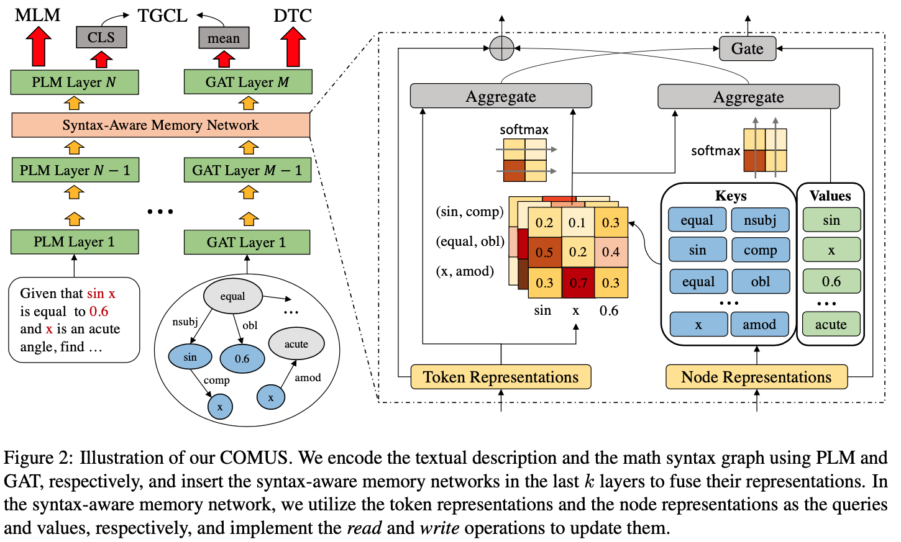

# COMUS
This is the official PyTorch implementation for the [paper](https://aclanthology.org/2022.acl-long.408/):
> Zheng Gong*, Kun Zhou*, Xin Zhao, Jing Sha, Shijin Wang, Ji-Rong Wen. Continual Pre-training of Language Models for Math Problem Understanding with Syntax-Aware Memory Network. ACL 2022.

## Overview

We propose ***COMUS***, a new approach to **co**ntinually pre-train language models for **m**ath problem **u**nderstanding with **s**yntax-aware memory network. We construct math syntax graph to model the structural semantic information, and then design the syntax-aware memory networks to deeply fuse the features from the graph and text. We finally devise three continual pre-training tasks to further align and fuse the representations of the text and math syntax graph.



## Requirements

```
# for model
torch==1.10.0
transformers==4.6.0
datasets==1.1.3
dgl==0.8.x
# for data process
jieba
sympy
bs4
stanza
timeout_decorator
```

## Dataset

Datasets cannot be shared temporarily for some commercial reasons. We put the data pre-processing code in the `data` folder for reference. In general, the pre-processing of the data consists of the following parts:
- Getting a clean corpus of math problems with formula location identifiers (like \$ a + b \$).
- Parsing the formulas into operator trees. In this project, we made some modifications to [TangentS](https://github.com/BehroozMansouri/TangentCFT/tree/master/TangentS) to accomplish this step (using sympy instead of latexml to perform latex-to-mathml formatting). **We suggest referring to the original project's code (TangentS) for this step.**
- Dependency parsing for math problem texts. We use [stanza](https://stanfordnlp.github.io/stanza/depparse.html) to do this.
- Combining the dependency parsing tree and the operator tree to obtain the math syntax graph.
- Organizing the data (including text and math syntax graph) into Dataset format.

## Training

#### Base Model
Please download the initial model from https://huggingface.co/models.
- Make sure your initial model is bert-like (bert or roberta). Otherwise you need to modify the training and model code.
- We run this project with bert-base. You can adjust the hyperparameters of GAT in `model/config.py` if you want to try larger model.

#### Scripts
You can run pre-training with single GPU by:
```bash
bash scripts/run_pretrain.sh
```
or run distributed data paralle pre-training with multiple GPUs by:
```bash
bash scripts/run_pretrain_ddp.sh
```

#### Arguments
You can check more details about training arguments in the [official docs](https://huggingface.co/transformers/v4.6.0/main_classes/trainer.html#trainingarguments) of huggingface. We explain some special arguments here.
- **add_token_path** - There may be some important words in your corpus that cannot be correctly split by the tokenizer of the pre-trained model, such as mathematical symbols. You can add them to the vocab by this argument and train the embedding from scratch.
- **graph_vocab_path** - The node set of math syntax graph.

*Note: You can choose any file type to store graph vocab and additional tokens. Just check and modify the loading code in `pretrain.py`.*

## Citation

Please consider citing our paper if you use our codes.

```bibtex
@inproceedings{gong-etal-2022-continual,
    title = "Continual Pre-training of Language Models for Math Problem Understanding with Syntax-Aware Memory Network",
    author = "Gong, Zheng  and
      Zhou, Kun  and
      Zhao, Xin  and
      Sha, Jing  and
      Wang, Shijin  and
      Wen, Ji-Rong",
    booktitle = "Proceedings of the 60th Annual Meeting of the Association for Computational Linguistics (Volume 1: Long Papers)",
    month = may,
    year = "2022",
    address = "Dublin, Ireland",
    publisher = "Association for Computational Linguistics",
    url = "https://aclanthology.org/2022.acl-long.408",
    doi = "10.18653/v1/2022.acl-long.408",
    pages = "5923--5933",
}
```